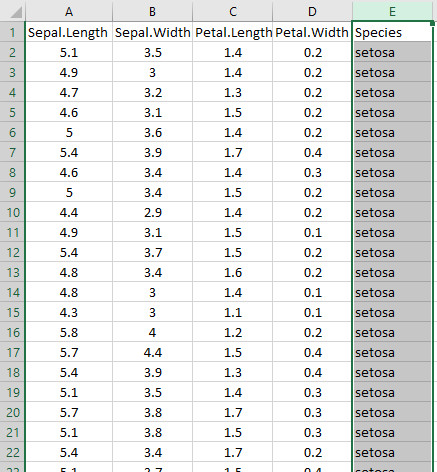
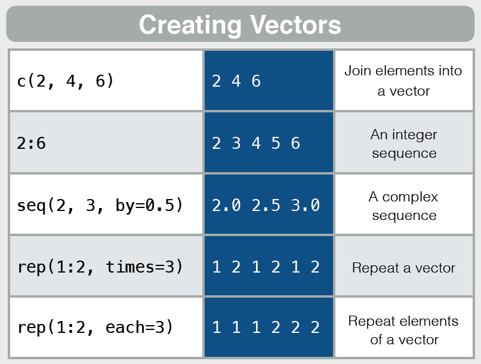
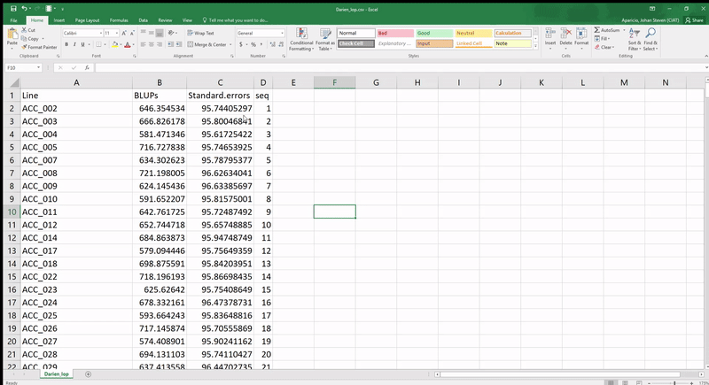
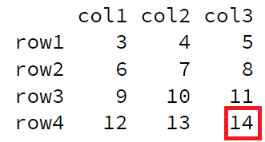
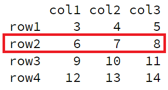
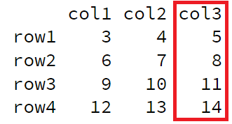
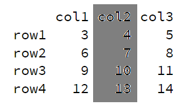
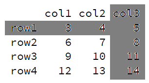

```{r setup, include=FALSE, comment=""}
options(htmltools.dir.version = FALSE)
```

class: center, middle

#Introduction into R for absolute beginners

###Johan Aparicio 
## International Center for Tropical Agriculture
## 2019/05/09


---

class: center, middle

# Recordando...

---

# Basic operations

```{r  , comment="" }
a <- 3+3 
b <- 3*4
c <- 4^2 
```
--

```{r , comment="" }
a + b + c
```


--

```{r, comment="" }
z <- log(200)
w <- exp(4) 
x <- sqrt(9)
```

--

```{r , comment="" }
z  - w  +  x
```


---

# Hello World

En R existen varios tipos de objectos que permiten que el usuario pueda almacenar la información para realizar procedimientos estadísticos y gráficos. 


Los principales objetos en R son:

- [Vectores](vectores)
- [Matrices](matrices) 
- [Marcos de datos](marcos de datos) 
- [Listas](listas)

---

background-image: url(images/r-vector.jpg)
background-size: 600px

# Vectors

---

# Vectors 

Vectors are ordered arrangements in which information of numerical type **([quantitative variable](quantitative variable))**, alphanumeric **([qualitative variable](qualitative variable))** or logical **([TRUE or FALSE](TRUE or FALSE))** can be stored, but not mixtures of these.

<br>

--


<center>

</center>


---


###Numeric ([Quantitative](Quantitative))

```{r , eval=FALSE}
a <- 41201 ; b <-  12.3 
```

--

-----------------

###Character ([Qualitative](Quanlitative))


```{r , eval=FALSE}
e <- "Dog"  ;  f <- "CIAT"  ;  g <-  "RStudio"
```


--

-----------------

### Boolean  ([Logical](Logical))


```{r, eval=FALSE }
TRUE

FALSE
```

```{r, eval=FALSE}
r <- 4 > 6  ;  w <- 400 == 30
```


---

# Class


```{r, comment=""}
a <- 41201

class(a)
```

--

-----------------

```{r, comment=""}
g <-  "RStudio"

class(g)
```

--

-----------------

```{r, comment=""}
r <- 4 > 6

class(r)
```


---
  
1.	Data nature and structure (Jaison, Mr Bean) (types of vectors, default datasets(iris, mtcars, etc)) 

2.	Summary/continue of basic operations

3.	Types of variables (numeric, character, factor, logical, integer, string, NA, NaN, NULL)

4.	Types of objects (atomic vectors, matrix, data.frames, lists, …arrays….)

5.	Vecor creation c(), rep(), seq()

6.	Vector indexing and element extraction

7.	Data.frame() explain and operations ($ and [rows,cols])

8.	Adding a row and a column

9.	Introduction to dplyr 

---


background-image: url(cheat.PNG)
background-size: 700px


---

# Example


<center>

</center>


---

# Vectors using colon operator 

```{r , comment=""}
# Creating a sequence from 5 to 13.
v <- 5:13
print(v) #<<
```

--
  
```{r , comment=""}
# Creating a sequence from 6.6 to 12.6.
v <- 6.6:12.6
print(v)
```

--
```{r , comment="" , eval=F}
# What happens in this case?
v <- 3.8:11.4  #<<
print(v) 
```

--

```{r,echo=FALSE, comment=""}
v <- 3.8:11.4 
print(v) 
```


---

class: middle

##Using sequence (seq.) operator


```{r, comment=""}
# Create vector with elements from 5 to 9 incrementing by 0.4.
test <- seq(from = 5, to = 9, by = 0.4)
```

--

```{r, comment=""}
print(test)
```


--

```{r, eval=F , echo=T}
# What happens in this case?
seq( from = 2 , to = 7 , by = 0.7)
```

--

```{r, echo=F, comment=""}
seq( from = 2 , to = 7 , by = 0.7)
```


.footnote[  **[_NOTE:_](_NOTE:_)**  arguments  ] 

---


#Using the c( ) function

```{r}
x <- c(1, 5, 4, 9, 0)
y <- c("Carlos", "Bean" , "Carolina Torres")
z <- c(TRUE, FALSE , FALSE)
```

-----------------

--

```{r, comment=""}
class(x)
class(y)
class(z)
```


---


##Giving different types of data item in a Vector


```{r}
y <- c(2,3,"ten")
```

--

Since vector is a collection of similar data type. Therefore, if we try to create vectors like the above example then Coercion takes place.

--

```{r, comment=""}
y
```

--

## Generic order in increasing fashion is as follows :

<center>

Boolean < Numeric < Character

</center>


---


```{r}
# Example 1
x <- c(3,4,5,"ten",TRUE)
```

--

```{r, comment=""}
x
```

-------------------

--

```{r}
# Example 2
p <- c(3,4,5,TRUE)
```

--

```{r, comment=""}
p
```

-------------------

--

```{r}
# Example 3
q <- c("car", FALSE, TRUE)
```

--

```{r, comment=""}
q
```

---

# Summary

<center>

</center>


---


# Creating seq using rep( )

```{r, comment="", eval=F }
rep( c(0,0,7), times = 4)
```

--

```{r, comment="", echo=F}
rep( c(0,0,7), times = 4)
```

--

```{r, comment="", eval=F}
rep( c(2,4,2), each = 4)
```

--

```{r, comment="", echo=F}
rep( c(2,4,2), each = 4)
```


--

```{r, comment="", eval=F}
rep( c(0,7), times = c(4, 3) )
```

--

```{r, comment="", echo=F}
rep( c(0,7), times = c(4, 3) )
```


--

```{r, comment="", eval=F}
rep( 1:3, length.out = 9)
```


--


```{r, comment="", echo=F}
rep( 1:3, length.out = 9)
```


---


#Accessing Vector Elements (1)

Elements of a Vector are accessed using indexing. The **[ ]** brackets are used for indexing. Indexing starts with position [1](1). Giving a negative value in the index drops that element from result.[TRUE](TRUE), [FALSE](FALSE) can also be used for indexing.

--

.pull-left[
```{r, comment=""}
# Accessing vector elements 
# using position.

t <- c("Sun","Mon","Tue")
u <- t[c(2,3)]
```
]


--

.pull-right[
```{r,  comment=""}
# Accessing vector elements 
# using logical indexing.

t <- c("Sun","Mon","Tue")
v <- t[c(TRUE,FALSE,FALSE)]
```

]

--


```{r, comment=""}
print(u)
```

--

```{r, comment=""}
print(v)
```


<!-- .footnote[[*] Not really. See next page.] -->


---

#Accessing Vector Elements (2)

Elements of a Vector are accessed using indexing. The **[ ]** brackets are used for indexing. Indexing starts with position [1](1). Giving a negative value in the index drops that element from result.[TRUE](TRUE), [FALSE](FALSE) or 0 and 1 can also be used for indexing.

--


.pull-left[
```{r, comment=""}
# Accessing vector elements
# using negative indexing.

t <- c("Sun","Mon","Tue")
x <- t[c(-2,-3)]
```
]


--

.pull-right[
```{r,  comment=""}
# Accessing vector elements 
# using indexing.

t <- c("Sun","Mon","Tue")
y <- t[c(4,8)]
```

]


--

```{r, comment=""}
print(x)
```

--

```{r, comment=""}
print(y)
```


---

#Accessing Vector Elements (3)


Elements of a Vector are accessed using names.

```{r}
I <- c("one"=1,"two"=2,"three"=3)
```

--

```{r,comment=""}
print(I)
```

--

```{r, comment=""}
I["one"] #<<
```

--

```{r, comment=""}
I[c("three","two")]  #<<
```


---

# Vector arithmetic

Two vectors of same length can be added, subtracted, multiplied or divided giving the result as a vector output.


```{r}
# Create two vectors.
v1 <- c(3, 8, 4, 5, 0, 11)
v2 <- c(4, 11, 0, 8, 1, 2)
```

--

.pull-left[
```{r, comment=""}
# Vector addition.
add.result <- v1+v2

# Vector subtraction.
sub.result <- v1-v2
```
]


--

.pull-right[
```{r,  comment=""}
# Vector multiplication.
multi.result <- v1*v2

# Vector division.
divi.result <- v1/v2
```

]


---


# Vector arithmetic

When we execute the code, it produces the following result:

```{r, comment=""}
print(add.result)
```

--

```{r, comment=""}
print(sub.result)

```

--

```{r, comment=""}
print(multi.result)
```


--

```{r, comment=""}
print(divi.result)
```


---

#Vector Element Recycling

If we apply arithmetic operations to two vectors of unequal length, then the elements of the shorter vector are recycled to complete the operations.

--

```{r, comment=""}
v1 <- c(3,8,4,5,0,11)
v2 <- c(4,11)
# V2 becomes c(4,11,4,11,4,11)

```
--

```{r, comment=""}
add.result <- v1+v2
print(add.result)
```

--

```{r, comment=""}
sub.result <- v1-v2
print(sub.result)
```

---

#Vector Element Sorting

Elements in a vector can be sorted using the sort() function.


<center>

</center>


---

#Vector Element Sorting

Elements in a vector can be sorted using the sort() function.


```{r}
v <- c(3,8,4,5,0,11, -9, 304)

# Sort the elements of the vector.
sort.result <- sort(v)
```
--
```{r}
# Sort the elements in the reverse order.
revsort.result <- sort(v, decreasing = TRUE)
```
--
```{r}
# Sorting character vectors.
v <- c("Red","Blue","yellow","violet")
sort.result <- sort(v)
```
--
```{r}
# Sorting character vectors in reverse order.
revsort.result <- sort(v, decreasing = TRUE)
```

---
class: middle

background-image: url(images/matrix.PNG)
background-size: 400px
background-position: 90% 8%

# R - Matrices

Matrices are the `R` objects in which the elements are arranged in a two-dimensional rectangular layout. They contain elements of the same types. Though we can create a matrix containing only [characters](characters) or only [logical](logical) values, they are not of much use. We use matrices containing [numeric](numeric) elements.

<center>
A Matrix is created using the `matrix()` function.
</center>


---

# Syntax

The basic syntax for creating a matrix in R is:


```{r, eval=F}
matrix(data, nrow, ncol, byrow, dimnames)
```


Following is the description of the parameters used −

1. **[data](data)** is the input vector which becomes the data elements of the matrix.

1. **[nrow](nrow)** is the number of rows to be created.

1. **[ncol](ncol)** is the number of columns to be created.

1. **[byrow](byrow)** is a logical clue. If `TRUE` then the input vector elements are arranged by row.

1. **[dimname](dimname)** is the names assigned to the rows and columns.

---

#Example

Create a matrix taking a vector of numbers as input.

--

```{r, comment=""}
# Elements are arranged sequentially by row.
M <- matrix(c(3:14), nrow = 4, byrow = TRUE)
print(M)
```

--

```{r , comment=""}
# Elements are arranged sequentially by column.
N <- matrix(c(3:14), nrow = 4, byrow = FALSE)
print(N)
```

---

#Example

Create a matrix taking a vector of numbers as input.


```{r, comment=""} 
# Define the column and row names.
rownames = c("row1", "row2", "row3", "row4")
colnames = c("col1", "col2", "col3")

P <- matrix(c(3:14), 
            nrow = 4,
            byrow = TRUE,
            dimnames = list(rownames, colnames))
print(P)
```

---

class: middle

# How to extract elements from a matrix?

As in the case of vectors, brackets [,] and inside, separated by a comma, the row number and column number that interest us are used to extract elements stored within a matrix.

---

# Example 1

- If we want to extract the value stored in row 4 and column 3.


<center>

</center>

--

```{r, comment=""}
P[4,3]
```

---

# Example 2

- If we want to retrieve the entire row 2 we use the following code.


<center>

</center>

--

```{r, comment=""}
P[2,]
```


---

# Example 3

- If we want to retrieve the entire column 3 we use the following code.

<center>

</center>

--

```{r, comment=""}
P[,3]
```

---


# Example 4

If we want to show the original matrix without columns 2 we use the following code.


<center>

</center>

--


```{r, comment=""}
P[,-2]
```


---

# Example 5

If we want to show the original matrix without row 1 and column 3 we use the following code.


<center>

</center>

--


```{r, comment=""}
P[-1,-3]
```


---

class: middle

# Data frame


The data frame is one of the most used objects since it allows grouping vectors with information of **different types** ([numerical](numerical), [alphanumeric](alphanumeric) or [logical](logical)) in the same object, the only restriction is that the vectors must have the **same length**.
The `data.frame()` function is used to create a data frame. 


---

# data(iris)

This famous (Fisher's or Anderson's) iris data set gives the measurements in centimeters of the variables sepal length and width and petal length and width, respectively, for 50 flowers from each of 3 species of iris. The species are Iris setosa, versicolor, and virginica.

--

<center>

</center>


---


# data(iris)

```{r}
data(iris)

# ?iris
```

--

```{r eval=require('DT'), tidy=FALSE, echo=F}
DT::datatable(
  head(iris, 8),
  fillContainer = F, options = list(pageLength = 4)
)
```


---

class: middle


# Iris

.pull-left[
```{r , warning=F, message=F, echo=F, fig.height=4,fig.width=5.5}
library(ggplot2)
library(plotly)
iris %>% ggplot(., aes(x=Sepal.Length,y=Sepal.Width,color=Species))+geom_point()+
  theme_bw()->p
ggplotly(p)
```
]

.pull-right[
```{r , warning=F, message=F, echo=F,fig.height=4,fig.width=5.5}
library(ggplot2)
library(plotly)
iris %>% ggplot(., aes(x=Petal.Length,y=Petal.Width,color=Species))+geom_point()+
  theme_bw()->p
ggplotly(p)
```
]


---


# Some Tips

- There are several ways to build incremental slides. See [this presentation](https://slides.yihui.name/xaringan/incremental.html) for examples.

- The option `highlightLines: true` of `nature` will highlight code lines that start with `*`, or are wrapped in `{{ }}`, or have trailing comments `#<<`;

    ```yaml
    output:
      xaringan::moon_reader:
        nature:
          highlightLines: true
    ```

    See examples on the next page.

---

# Some Tips


.pull-left[
An example using a leading `*`:

    ```r
    if (TRUE) {
    ** message("Very important!")
    }
    ```
Output:
```r
if (TRUE) {
* message("Very important!")
}
```

This is invalid R code, so it is a plain fenced code block that is not executed.
]

.pull-right[
An example using `{{}}`:

````
`r ''````{r tidy=FALSE}
if (TRUE) {
*{{ message("Very important!") }}
}
```
````
Output:
```{r tidy=FALSE}
if (TRUE) {
{{ message("Very important!") }}
}
```

It is valid R code so you can run it. Note that `{{}}` can wrap an R expression of multiple lines.
]

---

# Some Tips

An example of using the trailing comment `#<<` to highlight lines:

````markdown
`r ''````{r tidy=FALSE}
library(ggplot2)
ggplot(mtcars) + 
  aes(mpg, disp) + 
  geom_point() +   #<<
  geom_smooth()    #<<
```
````

Output:

```{r tidy=FALSE, eval=FALSE}
library(ggplot2)
ggplot(mtcars) + 
  aes(mpg, disp) + 
  geom_point() +   #<<
  geom_smooth()    #<<
```

---

# Some Tips

When you enable line-highlighting, you can also use the chunk option `highlight.output` to highlight specific lines of the text output from a code chunk. For example, `highlight.output = TRUE` means highlighting all lines, and `highlight.output = c(1, 3)` means highlighting the first and third line.

````md
`r ''````{r, highlight.output=c(1, 3)}
head(iris)
```
````

```{r, highlight.output=c(1, 3), echo=FALSE}
head(iris)
```

Question: what does `highlight.output = c(TRUE, FALSE)` mean? (Hint: think about R's recycling of vectors)

---
background-image: url(https://upload.wikimedia.org/wikipedia/commons/b/be/Sharingan_triple.svg)
background-size: 100px
background-position: 90% 8%


---


---

class: center, middle

# Thanks!

Slides created via the R package [**xaringan**](https://github.com/yihui/xaringan).

The chakra comes from [remark.js](https://remarkjs.com), [**knitr**](http://yihui.name/knitr), and [R Markdown](https://rmarkdown.rstudio.com).
