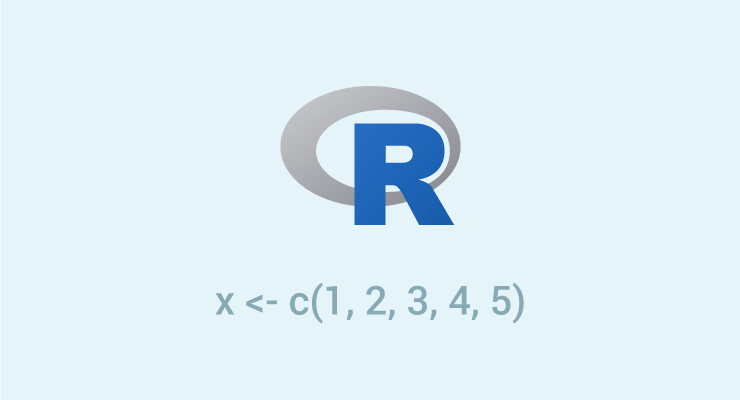

```{r setup, include=FALSE, comment=""}
options(htmltools.dir.version = FALSE)
```

class: center, middle

# Recordando...

---

background-image: url(logo.svg)
background-size: 120px
background-position: 10% 98%

# Basic operations

```{r  , comment="" }
a <- 3+3 
b <- 3*4
c <- 4^2 
```
--

```{r , comment="" }
a + b + c
```


--

```{r, comment="" }
z <- log(200)
w <- exp(4) 
x <- sqrt(9)
```

--

```{r , comment="" }
z  - w  +  x
```


---

background-image: url(logo.svg)
background-size: 120px
background-position: 10% 98%

# Hello World

En R existen varios tipos de objectos que permiten que el usuario pueda almacenar la información para realizar procedimientos estadísticos y gráficos. 


Los principales objetos en R son:

- [Vectores](vectores)
- [Matrices](matrices) 
- [Marcos de datos](marcos de datos) 
- [Listas](listas)

---

background-image: url(logo.svg)
background-size: 120px
background-position: 10% 98%


# Vectors

<center>

</center>


---

background-image: url(logo.svg)
background-size: 120px
background-position: 10% 98%

# Vectors 

Vectors are ordered arrangements in which information of numerical type **([quantitative variable](quantitative variable))**, alphanumeric **([qualitative variable](qualitative variable))** or logical **([TRUE or FALSE](TRUE or FALSE))** can be stored, but not mixtures of these.

<br>

--


<center>

</center>


---

background-image: url(logo.svg)
background-size: 120px
background-position: 10% 98%


###Numeric ([Quantitative](Quantitative))

```{r , eval=FALSE}
a <- 41201 ; b <-  12.3 
```

--

-----------------

###Character ([Qualitative](Quanlitative))


```{r , eval=FALSE}
e <- "Dog"  ;  f <- "CIAT"  ;  g <-  "RStudio"
```


--

-----------------

### Boolean  ([Logical](Logical))


```{r, eval=FALSE }
TRUE

FALSE
```

```{r, eval=FALSE}
r <- 4 > 6  ;  w <- 400 == 30
```


---

background-image: url(logo.svg)
background-size: 120px
background-position: 10% 98%

# Class


```{r, comment=""}
a <- 41201

class(a)
```

--

-----------------

```{r, comment=""}
g <-  "RStudio"

class(g)
```

--

-----------------

```{r, comment=""}
r <- 4 > 6

class(r)
```


---


background-image: url(cheat.PNG)
background-size: 700px


---

background-image: url(logo.svg)
background-size: 120px
background-position: 10% 98%

# Example


<center>

</center>


---

background-image: url(logo.svg)
background-size: 120px
background-position: 10% 98%

# Vectors using colon operator 

```{r , comment=""}
# Creating a sequence from 5 to 13.
v <- 5:13
print(v) #<<
```

--
  
```{r , comment=""}
# Creating a sequence from 6.6 to 12.6.
v <- 6.6:12.6
print(v)
```

--
```{r , comment="" , eval=F}
# What happens in this case?
v <- 3.8:11.4  #<<
print(v) 
```

--

```{r,echo=FALSE, comment=""}
v <- 3.8:11.4 
print(v) 
```


---

background-image: url(logo.svg)
background-size: 120px
background-position: 10% 98%

class: middle

##Using sequence (seq.) operator


```{r, comment=""}
# Create vector with elements from 5 to 9 incrementing by 0.4.
test <- seq(from = 5, to = 9, by = 0.4)
```

--

```{r, comment=""}
print(test)
```


--

```{r, eval=F , echo=T}
# What happens in this case?
seq( from = 2 , to = 7 , by = 0.7)
```

--

```{r, echo=F, comment=""}
seq( from = 2 , to = 7 , by = 0.7)
```

---

background-image: url(logo.svg)
background-size: 120px
background-position: 10% 98%

#Using the c( ) function

```{r}
x <- c(1, 5, 4, 9, 0)
y <- c("Carlos", "Bean" , "Carolina Torres")
z <- c(TRUE, FALSE , FALSE)
```

-----------------

--

```{r, comment=""}
class(x)
class(y)
class(z)
```


---

background-image: url(logo.svg)
background-size: 120px
background-position: 10% 98%

##Giving different types of data items in a Vector


```{r}
y <- c(2,3,"ten")
```

--

Since vector is a collection of similar data type. Therefore, if we try to create vectors like the above example then Coercion takes place.

--

```{r, comment=""}
y
```

--

## Generic order in increasing fashion is:


<center>
Boolean < Numeric < Character
</center>


---

background-image: url(logo.svg)
background-size: 120px
background-position: 10% 98%


```{r}
# Example 1
x <- c(3,4,5,"ten",TRUE)
```

--

```{r, comment=""}
x
```

-------------------

--

```{r}
# Example 2
p <- c(3,4,5,TRUE)
```

--

```{r, comment=""}
p
```

-------------------

--

```{r}
# Example 3
q <- c("car", FALSE, TRUE)
```

--

```{r, comment=""}
q
```

---

background-image: url(logo.svg)
background-size: 120px
background-position: 10% 98%

# Summary

<center>

</center>


---

background-image: url(logo.svg)
background-size: 120px
background-position: 10% 98%

# Creating seq using rep( )

```{r, comment="", eval=F }
rep( c(0,0,7), times = 4)
```

--

```{r, comment="", echo=F}
rep( c(0,0,7), times = 4)
```

--

```{r, comment="", eval=F}
rep( c(2,4,2), each = 4)
```

--

```{r, comment="", echo=F}
rep( c(2,4,2), each = 4)
```


--

```{r, comment="", eval=F}
rep( c(0,7), times = c(4, 3) )
```

--

```{r, comment="", echo=F}
rep( c(0,7), times = c(4, 3) )
```


--

```{r, comment="", eval=F}
rep( 1:3, length.out = 9)
```


--


```{r, comment="", echo=F}
rep( 1:3, length.out = 9)
```


---

background-image: url(logo.svg)
background-size: 120px
background-position: 10% 98%

#Accessing Vector Elements (1)

Elements of a Vector can be accessed using indexing. The **[ ]** brackets are used for indexing. Indexing starts with position [1](1). Giving a negative value in the index drops that element from the result.[TRUE](TRUE), [FALSE](FALSE) can also be used for indexing.

--

.pull-left[
```{r, comment=""}
# Accessing vector elements 
# using position.

t <- c("Sun","Mon","Tue")
u <- t[c(2,3)]
```
]


--

.pull-right[
```{r,  comment=""}
# Accessing vector elements 
# using logical indexing.

t <- c("Sun","Mon","Tue")
v <- t[c(TRUE,FALSE,FALSE)]
```

]

--


```{r, comment=""}
print(u)
```

--

```{r, comment=""}
print(v)
```


<!-- .footnote[[*] Not really. See next page.] -->


---

background-image: url(logo.svg)
background-size: 120px
background-position: 10% 98%

#Accessing Vector Elements (2)

Elements of a Vector can be accessed using indexing. The **[ ]** brackets are used for indexing. Indexing starts with position [1](1). Giving a negative value in the index drops that element from result.[TRUE](TRUE), [FALSE](FALSE) or 0 and 1 can also be used for indexing.

--


.pull-left[
```{r, comment=""}
# Accessing vector elements
# using negative indexing.

t <- c("Sun","Mon","Tue")
x <- t[c(-2,-3)]
```
]


--

.pull-right[
```{r,  comment=""}
# Accessing vector elements 
# using indexing.

t <- c("Sun","Mon","Tue")
y <- t[c(4,8)]
```

]


--

```{r, comment=""}
print(x)
```

--

```{r, comment=""}
print(y)
```


---


background-image: url(logo.svg)
background-size: 120px
background-position: 10% 98%

#Accessing Vector Elements (3)


Elements of a Vector can be accessed using names.

```{r}
I <- c("one"=1,"two"=2,"three"=3)
```

--

```{r,comment=""}
print(I)
```

--

```{r, comment=""}
I["one"] #<<
```

--

```{r, comment=""}
I[c("three","two")]  #<<
```


---

background-image: url(logo.svg)
background-size: 120px
background-position: 10% 98%

# Vector arithmetic

Two vectors of same length can be added, subtracted, multiplied or divided giving the result as a vector output.


```{r}
# Create two vectors.
v1 <- c(3, 8, 4, 5, 0, 11)
v2 <- c(4, 11, 0, 8, 1, 2)
```

--

.pull-left[
```{r, comment=""}
# Vector addition.
add.result <- v1+v2

# Vector subtraction.
sub.result <- v1-v2
```
]


--

.pull-right[
```{r,  comment=""}
# Vector multiplication.
multi.result <- v1*v2

# Vector division.
divi.result <- v1/v2
```

]


---

background-image: url(logo.svg)
background-size: 120px
background-position: 10% 98%

# Vector arithmetic

When we execute the code, it produces the following result:

```{r, comment=""}
print(add.result)
```

--

```{r, comment=""}
print(sub.result)

```

--

```{r, comment=""}
print(multi.result)
```


--

```{r, comment=""}
print(divi.result)
```


---

background-image: url(logo.svg)
background-size: 120px
background-position: 10% 98%

#Vector Element Recycling

If we apply arithmetic operations to two vectors of unequal length, then the elements of the shorter vector are recycled to complete the operations.

--

```{r, comment=""}
v1 <- c(3,8,4,5,0,11)
v2 <- c(4,11)
# V2 becomes c(4,11,4,11,4,11)

```
--

```{r, comment=""}
add.result <- v1+v2
print(add.result)
```

--

```{r, comment=""}
sub.result <- v1-v2
print(sub.result)
```

---

background-image: url(logo.svg)
background-size: 120px
background-position: 10% 98%

#Vector Element Sorting

Elements in a vector can be sorted using the sort() function.


<center>

</center>


---

background-image: url(logo.svg)
background-size: 120px
background-position: 10% 98%

#Vector Element Sorting

Elements in a vector can be sorted using the sort() function.


```{r}
v <- c(3,8,4,5,0,11, -9, 304)

# Sort the elements of the vector.
sort.result <- sort(v)
```
--
```{r}
# Sort the elements in the reverse order.
revsort.result <- sort(v, decreasing = TRUE)
```
--
```{r}
# Sorting character vectors.
v <- c("Red","Blue","yellow","violet")
sort.result <- sort(v)
```
--
```{r}
# Sorting character vectors in reverse order.
revsort.result <- sort(v, decreasing = TRUE)
```

---
class: middle

background-image: url(images/matrix.PNG)
background-size: 400px
background-position: 90% 8%

# R - Matrices

Matrices are the `R` objects in which the elements are arranged in a two-dimensional rectangular layout. They contain elements of the same types. Though we can create a matrix containing only [characters](characters) or only [logical](logical) values, they are not of much use. We use matrices containing [numeric](numeric) elements.

<center>
A Matrix is created using the `matrix()` function.
</center>


---

background-image: url(logo.svg)
background-size: 120px
background-position: 10% 98%

# Syntax

The basic syntax for creating a matrix in R is:


```{r, eval=F}
matrix(data, nrow, ncol, byrow, dimnames)
```


Following is the description of the parameters used −

1. **[data](data)** is the input vector which becomes the data elements of the matrix.

1. **[nrow](nrow)** is the number of rows to be created.

1. **[ncol](ncol)** is the number of columns to be created.

1. **[byrow](byrow)** is a logical clue. If `TRUE` then the input vector elements are arranged by row.

1. **[dimname](dimname)** is the names assigned to the rows and columns.

---

background-image: url(logo.svg)
background-size: 120px
background-position: 10% 98%

## Create a matrix taking a vector of numbers as input


--

```{r, comment=""}
# Elements are arranged sequentially by row.
M <- matrix(c(3:14), nrow = 4, byrow = TRUE)
print(M)
```

--

```{r , comment=""}
# Elements are arranged sequentially by column.
N <- matrix(c(3:14), nrow = 4, byrow = FALSE)
print(N)
```

---

background-image: url(logo.svg)
background-size: 120px
background-position: 10% 98%

#Example

Create a matrix taking a vector of numbers as input.


```{r, comment=""} 
# Define the column and row names.
rownames = c("row1", "row2", "row3", "row4")
colnames = c("col1", "col2", "col3")

P <- matrix(c(3:14), 
            nrow = 4,
            byrow = TRUE,
            dimnames = list(rownames, colnames))
print(P)
```

---

background-image: url(logo.svg)
background-size: 120px
background-position: 10% 98%

class: middle

# How to extract elements from a matrix?

As in the case of vectors, brackets [,] and inside, separated by a comma, the row number and column number that interest us are used to extract elements stored within a matrix.

---

background-image: url(logo.svg)
background-size: 120px
background-position: 10% 98%

# Example 1

- If we want to extract the value stored in row 4 and column 3.


<center>

</center>

--

```{r, comment=""}
P[4,3]
```

---

background-image: url(logo.svg)
background-size: 120px
background-position: 10% 98%

# Example 2

- If we want to retrieve the entire row 2 we use the following code.


<center>

</center>

--

```{r, comment=""}
P[2,]
```


---

background-image: url(logo.svg)
background-size: 120px
background-position: 10% 98%

# Example 3

- If we want to retrieve the entire column 3 we use the following code.

<center>

</center>

--

```{r, comment=""}
P[,3]
```

---

background-image: url(logo.svg)
background-size: 120px
background-position: 10% 98%

# Example 4

If we want to show the original matrix without columns 2 we use the following code.


<center>

</center>

--


```{r, comment=""}
P[,-2]
```


---

background-image: url(logo.svg)
background-size: 120px
background-position: 10% 98%

# Example 5

If we want to show the original matrix without row 1 and column 3 we use the following code.


<center>

</center>

--


```{r, comment=""}
P[-1,-3]
```


---

background-image: url(logo.svg)
background-size: 120px
background-position: 10% 98%

class: middle

# Data frame


The data frame is one of the most used objects since it allows grouping vectors with information of **different types** ([numerical](numerical), [alphanumeric](alphanumeric) or [logical](logical)) in the same object, the only restriction is that the vectors must have the **same length**.
The `data.frame()` function is used to create a data frame. 


---

background-image: url(logo.svg)
background-size: 120px
background-position: 10% 98%

# data(iris)

This famous (Fisher's or Anderson's) iris data set gives the measurements in centimeters of the variables sepal length and width and petal length and width, respectively, for 50 flowers from each of 3 species of iris. The species are Iris setosa, versicolor, and virginica.

--

<center>

</center>


---

background-image: url(logo.svg)
background-size: 120px
background-position: 10% 98%

# data(iris)

```{r}
data(iris)

# ?iris
```

--

```{r eval=require('DT'), tidy=FALSE, echo=F}
DT::datatable(
  head(iris, 8),
  fillContainer = F, options = list(pageLength = 4)
)
```


---

background-image: url(logo.svg)
background-size: 120px
background-position: 10% 98%

class: middle


# Iris

<center>
```{r , warning=F, message=F, echo=F, fig.width=9}
library(ggplot2)
library(plotly)
iris %>% ggplot(., aes(x=Sepal.Length,y=Sepal.Width,color=Species))+geom_point()+
  theme_bw(base_size = 15)->p
ggplotly(p)
```
</center>

---
background-image: url(logo.svg)
background-size: 120px
background-position: 10% 98%

class: middle

# Iris

<center>
```{r , warning=F, message=F, echo=F,fig.width=9}
library(ggplot2)
library(plotly)
iris %>% ggplot(., aes(x=Petal.Length,y=Petal.Width,color=Species))+geom_point()+
  theme_bw(base_size = 15)->p
ggplotly(p)
```
</center>

---

background-image: url(logo.svg)
background-size: 120px
background-position: 10% 98%

# How to extract elements from a data frame?

To retrieve the variables (columns) stored in a data frame, you can use the [$]($) operator, single square brackets [[]]([]) or double square brackets [[[]]]([[]]). Here are some examples to understand the differences between these options.

--

- If we want to extract the ["Sepal.Length"]("Sepal.Length") variable from the iris data frame as a vector, we use the following code.

--

```{r, comment="", eval=F}
iris$Sepal.Length
```

--

```{r, comment="", eval=F}
iris[,1]
```

--

```{r, comment="", eval=F}
iris[["Sepal.Length"]]
```

--

```{r, comment="", eval=F}
iris[,"Sepal.Length"]
```


---

background-image: url(logo.svg)
background-size: 120px
background-position: 10% 98%

#How to extract subsets of a data frame?

The `subset(x, subset, select)`  function can be used to extract parts of a data frame. The [x](x) parameter is used to indicate the original data frame, the [subset](subset) parameter is used to place the condition and the [select](select) parameter is used to keep only some of the variables in the data frame.

--

* If we want the iris data frame only with the setosa species we use the following code.

```{r, eval=F}
subset(iris, subset=Species == "setosa")
```

```{r, echo=F, comment=""}
head(subset(iris, subset=Species == "setosa"),8)
```

---

background-image: url(logo.svg)
background-size: 120px
background-position: 10% 98%

# Logical comparison operators in R

<center>

</center>


---
background-image: url(logo.svg)
background-size: 120px
background-position: 10% 98%

# Exercises

* Con la base de datos Iris, seleccionar un subconjuto de los datos donde se cumplan las siguientes condiciones:

  * Solo seleccionar las flores de especie Versicolor
  
  * Solo seleccionar las flores de especie Versicolor o setosa
  
  * Las flores con Sepal.length mayor que 6 
  
  * Las flores con Petal.width menor o igual a 0.8 

---

background-image: url(logo.svg)
background-size: 120px
background-position: 10% 98%

class: middle

# Creating Lists 

Lists are another type of object widely used to store objects of different types. The instruction to create a list is `list()`. Next we are going to create a list that contains [**three**](three) objects: 

* a vector with [**5**](5) random numbers called [**mivector**](mivector)
* a 6 × 2 dimension matrix with the first twelve positive integers called [**matrix2**](matrix2) 
* and the third object will be the [**iris**](iris) data frame loaded in the previous slide.

The instructions for creating the required list are shown below.

--

```{r, comment=""}
set.seed(1)
mivector <- rnorm(n=5)
matriz2 <- matrix(data=1:12, ncol=6)

milista <- list(E1=mivector, E2=matriz2, E3=iris) #<<
```

---
background-image: url(logo.svg)
background-size: 120px
background-position: 10% 98%

# Creating Lists 


The `set.seed` function of line number 1 serves to set the seed in such a way that the random numbers generated in the second line with the `rnorm( )` function are always the same.

```{r, comment=""}
print(milista)
```


---
background-image: url(logo.svg)
background-size: 120px
background-position: 10% 98%

class: middle

# How to extract items from a list?

To retrieve items stored in a list, use the [$]($) operator, double square brackets [[[]]]([[]]) or single square brackets [[]]([]). Here are some examples to understand how to extract items from a list.

---
background-image: url(logo.svg)
background-size: 120px
background-position: 10% 98%

# How to extract items from a list?

```{r, comment=""}
milista$E2
```
--

```{r, comment=""}
milista[[2]]
```
--

```{r, comment=""}

milista[2]
```

---
background-image: url(logo.svg)
background-size: 120px
background-position: 10% 98%

# Using class for items in a list


```{r, comment=""}
class(milista$E2)

class(milista[[2]])

class(milista[2])
```


---

class: middle

background-image: url(logo.svg)
background-size: 120px
background-position: 10% 98%

# Exercises

1. Cargue la base de datos mtcars ([?mtcars](?mtcars))

2. Identifique la estructura de la base de datos.

3. Realice un resumen general.

4. ¿Qué sucede con la variable vs?
  ¿Realmente es una variable númerica?
  
5. Realice un resumen para los autos con transmisión automática.

6. Guarde en una nueva base de datos los vehículos  con más de 5 carburadores.

7. Almacene en un nuevo vector llamado temp, la variable mpg.

8. Seleccione de temp sólo los valores que superan los 20 mpg

---

class: middle

background-image: url(logo.svg)
background-size: 120px
background-position: 10% 98%

# Database reading

## In what format to store a database?


Preferably, save the information in `.csv` or `.txt` and then if we import this to R.


---

background-image: url(logo.svg)
background-size: 120px
background-position: 10% 98%

# Database reading (Excel)

Se debe iniciar en la parte superior izquierda, no se deben dejar filas vacías, no se debe colorear, no se deben colocar bordes ni nada, se ingresa la información sin embellecer el contenido. Por último se guarda el archivo en la carpeta deseada y al momento de nombrar el archivo se debe modificar la opción tipo de archivo a csv (delimitado por comas).

<center>

</center>


---

class: middle

background-image: url(logo.svg)
background-size: 120px
background-position: 10% 98%

# Database reading


```r
read.table(file, header = FALSE, sep = "", quote = "\"'",
           dec = ".", row.names, col.names)

read.csv(file, header = TRUE, sep = ",", quote = "\"",
         dec = ".", fill = TRUE, comment.char = "", ...)

read.csv2(file, header = TRUE, sep = ";", quote = "\"",
          dec = ",", fill = TRUE, comment.char = "", ...)

read.delim(file, header = TRUE, sep = "\t", quote = "\"",
           dec = ".", fill = TRUE, comment.char = "", ...)

read.delim2(file, header = TRUE, sep = "\t", quote = "\"",
            dec = ",", fill = TRUE, comment.char = "", ...) 
```


---
background-image: url(logo.svg)
background-size: 120px
background-position: 10% 98%

class: center, middle

# Thanks!

Slides created via the R package [**xaringan**](https://github.com/yihui/xaringan).

[**https://apariciojohan.github.io/**](https://apariciojohan.github.io/)

Johan Aparicio 
